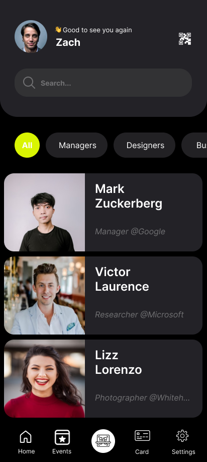

# NetworQ


**NetworQ** solves the "Who was that again?" problem. It is a context-aware networking application that helps users organize contacts based on the specific events where they met, ensuring you never lose the context behind a handshake.

---

## 📱 Screenshots & Design

> **Design Philosophy:** The app follows modern **Material Design** principles, ensuring a clean, accessible, and intuitive user experience.

<p align="center">
  
  &nbsp;&nbsp;&nbsp;&nbsp; 
</p>

**View the Design Prototype:**
[Click here to view the Figma Prototype](https://www.figma.com/proto/5pEpDSOJiZIbbQirIpAAWc/Untitled?node-id=1-6&p=f&t=xtOAuApnmL5CKXL4-0&scaling=scale-down&content-scaling=fixed&page-id=0%3A1&starting-point-node-id=1%3A6)

---

## ✨ Features

**Current MVP Features:**
* **Event-Based Organization:** Create specific events (e.g., "Tech Summit 2025") and group contacts under them.
* **Detailed Profiles:** Store essential contact info along with contextual notes about the meeting.
* **Personal Details:** Manage your own networking profile card.
* **Search & Filter:** Quickly locate people based on the event you met them at.

**🚀 Upcoming Roadmap (Experimental):**
* **Instant Context Caller ID:** A floating overlay that triggers when a saved contact calls you. It displays a "cheat sheet" (Name, Event Met, Key Notes) so you can answer the phone with confidence.
* **QR Code Exchange:** Seamlessly swap details with other NetworQ users.

---

## 🛠 Technical Stack

This project is built with modern Android development standards in mind, focusing on scalability and clean architecture.

* **Language:** Kotlin
* **UI Framework:** Jetpack Compose (Declarative UI)
* **Architecture:** MVVM (Model-View-ViewModel) with Clean Architecture principles.
* **Dependency Injection:** Koin
* **Local Persistence:** Room Database
* **Project Structure:** Multi-module architecture (Separating features, core, and UI logic).

---

## Architecture Overview

The app uses a **modularized approach** to ensure separation of concerns and faster build times.

* **:app** - The main entry point.
* **:core** - Contains shared logic and base classes.
* **:data** - Handles Room database and repository implementations.
* **:domain** - Contains repositories and shared usecases
* **:modules-features** - Individual feature modules.
* **:modules-sources** -Handles logic for interacting with different data sources.
* **:modules-ui** -Contains shared UI components.

---

## 💻 Installation & Setup

This project is set up for easy onboarding. You do not need any complex API keys to run the MVP version.

1.  **Prerequisites:**
    * Android Studio (Ladybug or Koala recommended).
    * JDK 17 or higher.

2.  **Clone the repository:**
    ```bash
    git clone [https://github.com/yourusername/NetworQ.git](https://github.com/victesa/NetworQ.git)
    ```

3.  **Run the App:**
    * Open the project in Android Studio.
    * Sync Gradle.
    * Select an emulator or physical device and click **Run**.

---

## 🤝 Contributing

Contributions are welcome! This project is open-source, and we are looking for help specifically with:

* Refining the experimental "Floating Window" feature.
* Adding unit tests for the ViewModels.
* Improving the UI transitions in Compose.

**How to contribute:**
1.  Fork the project.
2.  Create your feature branch (`git checkout -b feature/AmazingFeature`).
3.  Commit your changes (`git commit -m 'Add some AmazingFeature'`).
4.  Push to the branch (`git push origin feature/AmazingFeature`).
5.  Open a Pull Request.

---

## 📄 License

Distributed under the MIT License. See `LICENSE` for more information.